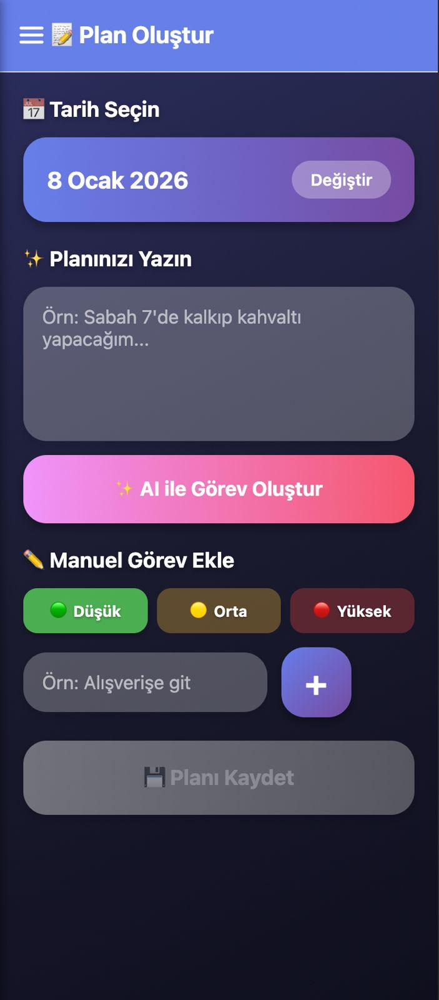
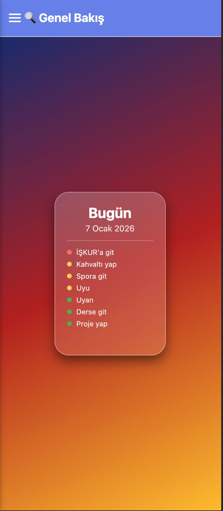
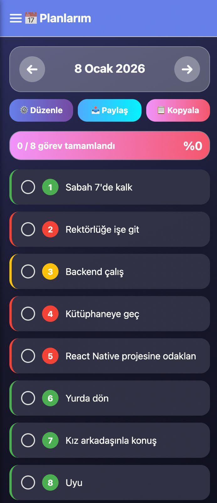
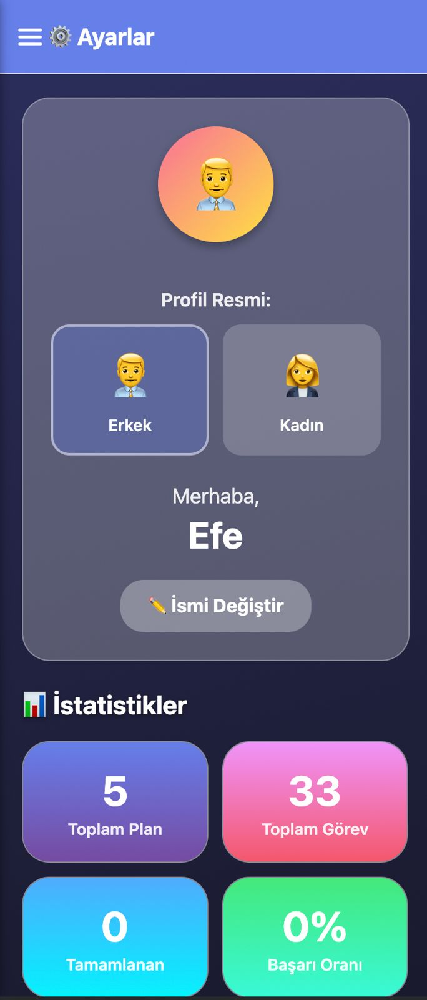

# DailyPlanner - AI Powered Task Management App 🤖📅

**DailyPlanner**, sıradan bir yapılacaklar listesi uygulamasının ötesine geçerek, yapay zeka desteği ile dağınık düşüncelerinizi veya notlarınızı otomatik olarak yapılandırılmış görev planlarına dönüştüren akıllı bir mobil uygulamadır.

> **Not:** Bu proje, **Mobil Uygulama Geliştirme** dersi final projesi olarak geliştirilmiştir.

## 📱 Proje Özeti ve Amacı (Overview)

Günlük hayatta aklımıza gelen yapılacaklar çoğu zaman karmaşık paragraflar veya sesli düşünceler halindedir. Bu uygulama, Google Gemini AI teknolojisini kullanarak kullanıcının serbest metin girişlerini analiz eder, bunları atomik görevlere böler ve yönetilebilir bir plan haline getirir.

Uygulama, "To-Do List" konseptine **üretken yapay zeka** katmanı ekleyerek özgün bir çözüm sunmaktadır.

## ✨ Temel Özellikler (Key Features)

* **🧠 AI Destekli Plan Oluşturma:** Kullanıcının girdiği paragrafları analiz eder ve bunları anlamlı, maddeler halindeki görev listelerine dönüştürür.
* **💾 Kalıcı Veri Yönetimi (Data Persistence):** `AsyncStorage` kullanılarak veriler cihazda yerel olarak saklanır. Uygulama kapatılsa bile veriler kaybolmaz.
* **🔔 Akıllı Bildirimler:** Planlanan görevler için zamanı geldiğinde yerel bildirimler (Local Notifications) gönderir.
* **🎨 Modern ve Akıcı UI:** `react-native-reanimated` ile güçlendirilmiş animasyonlar, özel Drawer menüsü ve kullanıcı dostu arayüz.
* **📅 Gelişmiş Takvim Görünümü:** Görevlerinizi günlük veya çoklu gün görünümünde takip etme imkanı.
* **📤 Paylaşım:** Oluşturulan planları metin olarak diğer uygulamalarla paylaşabilme.

## 📸 Uygulama Görselleri (Screenshots)

<div align="center">
  
  
</div>

*Sol: Plan Oluştur Ekranı | Sağ: Genel Bakış Ekranı*

<div align="center">
  
  
</div>

*Sol: Planlarım Ekranı | Sağ: Ayarlar Ekranı*

## 🛠️ Teknoloji Yığını (Tech Stack)

Proje, performans ve geliştirici deneyimi açısından modern araçlar seçilerek geliştirilmiştir:

| Kategori | Teknoloji / Kütüphane | Açıklama |
| --- | --- | --- |
| **Framework** | **React Native (Expo)** | Cross-platform mobil geliştirme altyapısı |
| **Dil** | **TypeScript** | Tip güvenliği, kod okunabilirliği ve hata önleme |
| **Yapay Zeka** | **Google Gemini API** | Doğal dil işleme ve görev çıkarma (Task Extraction) |
| **Navigasyon** | **React Navigation v7** | Stack ve Drawer navigasyon yapıları |
| **State/Storage** | **Context API & AsyncStorage** | Uygulama durumu ve yerel veri tabanı yönetimi |
| **UI & Animasyon** | **Reanimated 3 & Linear Gradient** | Yüksek performanslı animasyonlar ve görsel efektler |

## 📈 Ölçeklenebilirlik ve Maliyet Stratejisi (Scalability & Cost Strategy)

Bu proje şu anda bireysel kullanım ve prototipleme (MVP) aşamasındadır.

* **Mevcut Durum (Current State):** Proje, **Gemini 2.5 Flash** modelini kullanmaktadır. Bu model, düşük gecikme süresi (low latency) ve günlük 1M token ücretsiz kullanım hakkı nedeniyle tercih edilmiştir. Bireysel kullanım için en optimum çözümdür.
* **Gelecek Vizyonu (Production Strategy):** Uygulama geniş kitlelere (10.000+ kullanıcı) açıldığında maliyetleri optimize etmek için:
1. **Fine-Tuning:** Büyük genel modeller yerine, sadece "metinden görev çıkarma" işlevi için eğitilmiş daha küçük açık kaynak modeller (örn. Gemma 2B) kullanılacaktır.
2. **Maliyet Optimizasyonu:** Bu geçiş, API maliyetlerini %90 oranında düşürecek ve yanıt sürelerini daha da hızlandıracaktır.

## 🚀 Kurulum ve Çalıştırma (Setup & Run)

Projeyi kendi bilgisayarınızda çalıştırmak için aşağıdaki adımları izleyin:

### 1. Projeyi Klonlayın

```bash
git clone https://github.com/Misaki0808/DailyPlanner.git
cd DailyPlanner
```

### 2. Bağımlılıkları Yükleyin

```bash
npm install
```

### 3. API Anahtarını Ayarlayın (.env)

Uygulamanın AI özelliklerinin çalışması için bir Google Gemini API anahtarına ihtiyacınız vardır:

1. [Google AI Studio](https://aistudio.google.com/) adresinden ücretsiz bir API Key alın.
2. Projenin ana dizininde `.env` adında bir dosya oluşturun.
3. Aşağıdaki satırı ekleyin:

```properties
EXPO_PUBLIC_GEMINI_API_KEY=AIzaSy...Sizin_API_Anahtarınız
```

### 4. Uygulamayı Başlatın

```bash
npx expo start
```

* **Android:** `a` tuşuna basın veya QR kodu okutun.
* **iOS:** `i` tuşuna basın.

## 📂 Proje Mimarisi (Architecture)

Kod tabanı, modülerlik ve bakım kolaylığı (maintainability) gözetilerek yapılandırılmıştır:

```text
src/
├── components/     # Yeniden kullanılabilir UI bileşenleri (Modals, CustomDrawer vb.)
├── context/        # Global state yönetimi (AppContext)
├── screens/        # Uygulama ekranları (CreatePlan, Overview, Settings)
├── types/          # TypeScript veri tipleri ve arayüzler
└── utils/          # Yardımcı fonksiyonlar
    ├── aiService.ts           # Gemini API servis katmanı
    ├── storage.ts             # AsyncStorage veri erişim katmanı
    ├── notificationService.ts # Bildirim yönetimi
    └── dateUtils.ts           # Tarih ve saat işlemleri
```

## 🔮 Gelecek İyileştirmeler (Future Improvements)

Projenin yol haritasında (roadmap) planlanan özellikler:

1. **🎙️ Sesli AI Asistanı (Voice Task Definition):** *[En Öncelikli]* Kullanıcının uygulamaya sesli komut vererek ("Yarın sabah 9'da toplantım var, sonrasında spora gideceğim") görevlerini tanımlaması ve AI'ın bunu plana dökmesi.
2. **☁️ Cloud Sync:** Verilerin Firebase veya Supabase ile buluta yedeklenmesi ve cihazlar arası senkronizasyon.
3. **🌍 Çoklu Dil Desteği (i18n):** Uygulamanın Türkçe ve İngilizce dil seçeneklerine sahip olması.
4. **📱 Widget Desteği:** Ana ekrandan hızlı erişim için widget eklentisi.

## 📝 Akademik Doğruluk Beyanı

Bu proje, dersin "Originality & Academic Integrity" kurallarına tam uygun olarak geliştirilmiştir.

* Kodlar, hazır bir projeden kopyalanmamış (no fork/clone), özgün olarak yazılmıştır.
* Kullanılan açık kaynak kütüphaneler (React Navigation, Expo vb.) standartlara uygun şekilde projeye dahil edilmiştir.
* Yapay zeka entegrasyonu ve mimari kararlar öğrenci tarafından yapılmıştır.

---

**Geliştirici:** Efe Baydemir  
**Tarih:** Aralık 2025